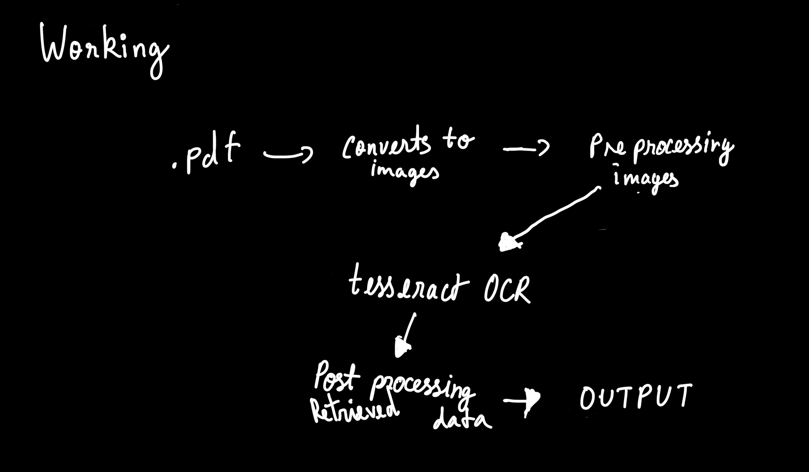

# Kannada OCR - Optical Character Recognition for Kannada Text

**Authors:** Sabari K, Abraham, Deepak  
**Hackathon:** Freethought Labs & Christ University  
**Date:** 2nd October 2024  

## Project Overview
This project is a **Kannada OCR (Optical Character Recognition)** system designed to recognize and convert Kannada text into machine-encoded text. The aim is to enhance the accuracy of OCR models for Kannada scripts by leveraging modern image processing and deep learning techniques.

### Prerequisites
- **Python 3.8+**: Ensure you have Python installed. You can download it from [python.org](https://www.python.org/downloads/).
- **Tesseract OCR**: Install Tesseract OCR for text recognition.
  - On Ubuntu:
    ```bash
    sudo apt-get install tesseract-ocr
    ```
- **Clone the Repository**: Use the following command to clone the repository:
    ```bash
    git clone https://github.com/sabari8956/kannada-ocr.git
    ```

- **Environment Variables**: Create a `.env` file in the root directory with the following content:
    ```plaintext
    OPENAI_API_KEY=<your key>
    OPENAI_API_ENDPOINT=<your endpoint>
    ```

### Run the Project
    ``` python main.py docs/book.pdf ```

## How it works




## Future Improvements 
- Enhance recognition accuracy by training on larger datasets.
- Develop a GUI for improved user interaction. (Currently in progress.)

### Contribution Guidelines
Contributions are welcome! Feel free to raise issues or submit pull requests to improve the system.